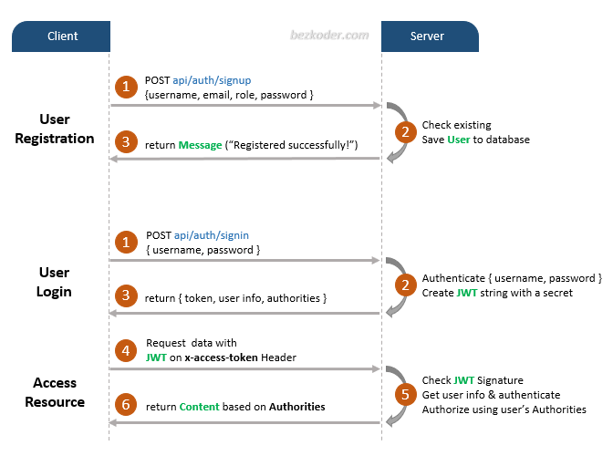
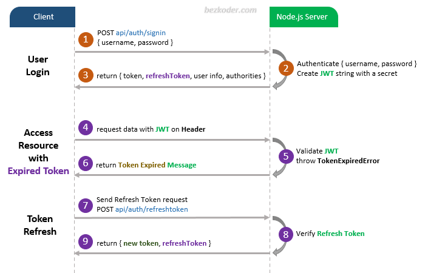
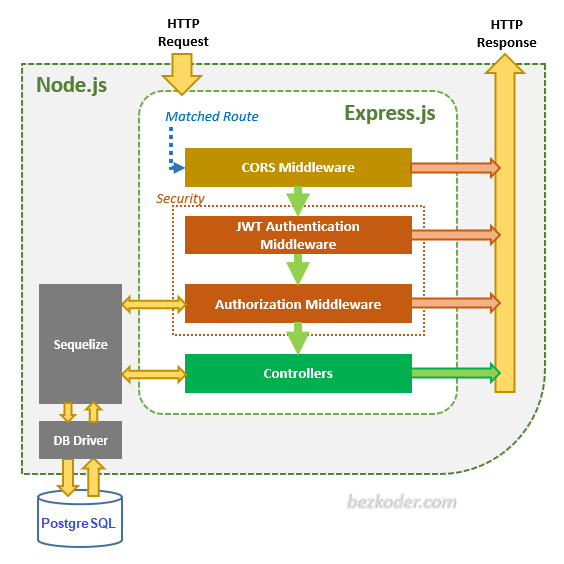

# Auth 1B

## 1. Basic Knowledge

### a. Authentication vs Authorization:

+ AuthN: who you are
    + sth you know: password
    + sth you have: physical devices
    + sth you are: biometrics
    + some authentication methods: 
        + password-based
        + multi-factor authN (MFA)
        + single-sign on (SSO)
        + magic link/passwordless
+ AuthZ: what you have access to
    + usually done after successfull authentication
    + info is transmitted through an Access Token (Authorization credential, in the form of an opaque string or JWT, used to access an API)
    + Role-based access control (RBAC)

### b. Session-based vs Token-based Authentication

+ make a server trust any request sent by an authenticated user over the internet --> a user can interact with their account without continually specifying their credentials.

+ session-based authN:
    + small file about the user, generated and stored on the server to keep track of the user requests
    + user interacts with server via session ID 
    + pros: since sessions are stored on the server, its admins are in power over them.
    + cons: since a session is stored on the server, the server is in charge of looking up the session ID, this can cause scalability problems 

+ token-based authN:
    + cannot be tampered with, generated by the server using a secret key, sent to and stored by the user in their local storage
    + user sends this token to the server with every new request, so that the server can verify its signature and authorize the requests.
    + pros: improve thei performances because the server do not need to continuously look through all the session details to authorize the user's requests
    + cons: the server cannot perform certain security operations as in the session method 

### c. Password Storage Basics

+ when passwords are stored properly, they must be protected from an attacker even if the application or database is compromised, include offline password cracking 

+ hashing vs encryption
    + both can keep sensitive data safe, but in almost all circumstances, passwords should be hashed, NOT encrypted.
    + hashing is a `one-way function`, a one-way blender, impossible to "decrypt" a hash and obtain the original plaintext value --> even if an attacker obtains the hashed password, they cannot use it to log in as the victim
    + encryption is a `two-way function`, attackers can retrieve the original plaintext from the encrypted data
    + the only time encryption should be used in passwords is in edge cases where it is necessary to obtain the original plaintext password, when the app needs to authen with another system that does not support a modern way to programmatically grant access, such as OpenID Connect (OIDC)

+ strong passwords stored with modern hashing algorithms and using hashing best practices should be effectively impossible for an attacker to crack.

+ how attackers can crack your password
    + select a password you think the victim has chosen (e.g. password1!), calculating the hash then comparing the hash you calculated to the hash of the victim
    + attackers will repeat this process with a list of large number of potential candidate passwords, with high speed hardware (GPUs) and cloud services with many server for rent
        + rainbow table

+ methods for enhancing password storage
    + salting: a unique, randomly generated string for each password --> protect against rainbow tables, no 2 users have the same password without cracking the hashes. Modern hashing algorithms such as Argon2id, bcrypt and PBKDF2 automatically salt the passwords
    + peppering: additional layer of protection, it is shared between stored passwords, should not be public and should not be stored along with the generated hash. The pepper should be stored separately from the password database. It prevents an attacker from being able to crack any of hashes if they only have access to the database.
        + pre-hashing peppers
        + post-hashing peppers

+ password hashing algorithms
    + argon2id
    + scrypt
    + bcrypt (should only be used for password storage in legacy systems where Argon2 and scrypt are not available)
    + PBKDF2

## 2. Project

### a. Simple jwt authentication

> referrer: https://www.bezkoder.com/node-js-jwt-authentication-postgresql/

+ techstack: nodejs + express + postgresql + sequelize (ORM) + docker
    + token-based authentication, there are 3 important parts of a JWT: `[header].[payload].[signature]`. Client typically attaches JWT in `Authorization` header with `Bearer` prefix or in `x-access-token` header on each request after successful authentication.
    + referrer:
        + https://sequelize.org/
+ overview of this app:
    + user can signup new account, or login with username & password
    + user info will be stored in PostgreSQL database
    + by user's role (admin, moderator, user), we authorize the user to access resources

+ apis we need to provide:

    | Methods   | Urls              | Actions               |
    |-----------|-------------------|-----------------------|
    | POST      | /api/auth/signup  | signup new account    |
    | POST      | /api/auth/signin  | login an account      |
    | GET       | /api/test/all     | retrieve public content   |
    | GET       | /api/test/user    | access User's content |
    | GET       | /api/test/mod     | access Moderator's content    |
    | GET       | /api/test/admin   | access Admin's content    |


+ flow for signup & login 

    

+ and we need to implement `Refresh Token`:

    

+ nodejs express architecture with authN & authZ:

    

    + Via Express routes, HTTP request that matches a route will be checked by CORS middleware before coming to Security layer (JWT authN middleware and authZ middleware)
    + if these middlewares throw any error, a message will be sent as HTTP response
    + Controllers interact with PostgreSQL database via Sequelize and send HTTP response to client.

+ dockerize application
    + after complete `docker-compose.yml`, workflow:
        + `docker compose up --build`, rebuild image if Dockerfile is changed -> restart app + db
        + `docker compose up`, no rebuild, just restart container -> volume mount hot-reload automatically
        + `docker compose down`, stop + delete container (DB is still alive via volume)
        + `docker compose down -v`, reset everything, include DB
    + docker + nodemon for dev environment
        + changing code won't restart the server, refer: https://stackoverflow.com/questions/27226653/nodemon-is-not-working-in-docker-environment
    + referrer: 
        + https://www.bezkoder.com/docker-compose-nodejs-postgres/
        + https://dev.to/nodepractices/docker-best-practices-with-node-js-4ln4
        + https://www.digitalocean.com/community/tutorials/how-to-build-a-node-js-application-with-docker

### b. Securing passwords in Node.js: the Argon2 way

> https://hackernoon.com/argon2-in-practice-how-to-implement-secure-password-hashing-in-your-application

+ Argon2 was specifically designed to counter the most elegant attack vectors that we have today --> password hashing champion.

+ pros:
    + memory-hardness: argon2 uses huge amounts of memory while hashing. --> scalable use of GPUs or ASICs cannot be relied upon by attackers in cracking passwords --> very expensive in parallel computing environments
    + tunable parameters: adjust on memory capacity usage, parallelism and execution time
    + defense-in-depth: designed to resist not only brute-force attacks, but also side-channel attacks, time-memory trade-offs, and many other complicated ways hackers break passwords.

+ we will use `argon2id`, the hybrid solution from `argon2i` and `argon2d`, and the one most often recommended. In Node.js world, `argon2` is probably the most famous package binding to the C implementation

    ```bash
    $ npm install argon2
    ```

+ actual implementation: hashing passwords with argon2
    + step 1: generate a cryptographically secure salt. In node.js,  we use `crypto.randomBytes()`. A salt length should preferably be 16 bytes or more (128bits) in size.
    + step 2: set up Argon2 parameters (where the most common mistakes occur for many devs). Benchmarking it on the server and calibrating your params to obtain a hashing time of 250-500ms.
        + Memory cost: how much memory the algorithm will use, the more the better is for security. (KiB)
        + Time cost: the number of iterations or passes over the memory. High is slow but provides more security.
        + Parallelism: how many parallel threds should it use? usually, that should match the number of available CPU cores
        + Hash length: the output size of the hash expressed in bytes
    + step 3: call the Argon2 Hash function

    ```javascript
    <!-- Nodejs example -->
    const argon2 = require('argon2');
    const crypto = require('crypto');
    // we can use additional PEPPER
    async function hashPassword(password) {
        // Configure the algorithm
        const options = {
            type: argon2.argon2id,    // Variant of Argon2
            memoryCost: 65536,        // 64 MiB
            timeCost: 2,              // 2 passes
            parallelism: 4,           // 4 threads
            hashLength: 32,           // 32 bytes output
            saltLength: 16,           // 16 bytes salt
            // You can also provide your own salt:
            // salt: crypto.randomBytes(16) 
        };
        
        try {
            // Hash the password (salt is generated automatically by default)
            const hash = await argon2.hash(password, options);
            return hash;
        } catch (err) {
            console.error('Error hashing password:', err);
            throw err;
        }
    }

    // Example usage
    hashPassword('super_secret_password')
        .then(hash => console.log('Hashed password:', hash))
        .catch(err => console.error(err));

    // This will produce something like:
    // $argon2id$v=19$m=65536,t=3,p=4$G8NYSxrA+UMGHJbZVIXXXQ$UrHyBcYfCEms+92QVzGmfYqrWtH54WJY9FuROBQi/X8
    ```
+ Understanding the Output Format
    ```javascript
    $argon2id$v=19$m=65536,t=3,p=4$G8NYSxrA+UMGHJbZVIXXXQ$UrHyBcYfCEms+92QVzGmfYqrWtH54WJY9FuROBQi/X8
    ```
    + `$argon2id`: the variant of the algorithm
    + `v=19`: version of the argon2 
    + `m=65536,t=3,p=4`: parameters (memory=65536 KiB, time=3 iterations, parallelism=4 threads)
    + `G8NYSxrA+UMGHJbZVIXXXQ`: base64-encoded salt
    + `UrHyBcYfCEms+92QVzGmfYqrWtH54WJY9FuROBQi/X8`: base64-encoded hash

+ Verifying Passwords Securely

    ```javascript
    const argon2 = require('argon2');

    async function verifyPassword(storedHash, providedPassword) {
        try {
            // The verify function returns true if the password matches
            // It returns false if the password doesn't match
            const isValid = await argon2.verify(storedHash, providedPassword);
            return isValid;
        } catch (err) {
            // Handle errors like invalid hash format
            console.error('Error during password verification:', err);
            return false;
        }
    }

    // Example usage
    const storedHash = '$argon2id$v=19$m=65536,t=3,p=4$G8NYSxrA+UMGHJbZVIXXXQ$UrHyBcYfCEms+92QVzGmfYqrWtH54WJY9FuROBQi/X8';

    verifyPassword(storedHash, 'super_secret_password')
        .then(isValid => {
            if (isValid) {
                console.log('Password is correct!');
            } else {
                console.log('Password is incorrect!');
            }
        })
        .catch(err => console.error(err));
    ```
